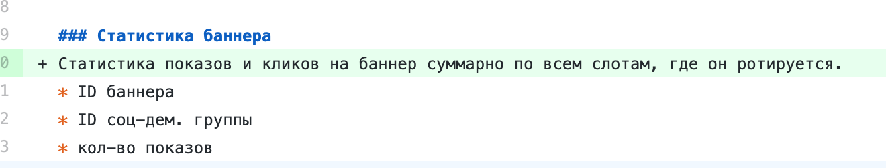

.center.icon[]

---

class: top white
background-image: url(img/sound.svg)
background-size: 130%
.top.icon[]

.sound-top[
  # Как меня слышно и видно?
]

.sound-bottom[
  ## > Напишите в чат
  ### **+** если все хорошо
  ### **-** если есть проблемы cо звуком или с видео
  ### !проверить запись!
]

---

# Сроки

* промежуточное ревью: сдать до 4 февраля включительно
* окончательное ревью: сдать до 20 февраля включительно


---

# golangci-lint

* много всего [дизейблит по умолчанию](https://github.com/golangci/golangci-lint#disabled-by-default-linters--e--enable)


* можно использовать suppressing
```golang
db.DB().SetMaxOpenConns(100)  //nolint:gomnd
```

* возможный конфиг: **.golangci.yml**

```yaml
run:
  tests: false
​
linters:
  enable-all: true
  disable:
    - gochecknoglobals
    - gochecknoinits
    - godox
    - lll
    - nakedret
    - wsl
```

---

# Вопросы не по ротации баннеров?


---

background-size: 65%
background-image: url(img/banners.png)

# Ротация баннеров: концепция

---

# Ротация баннеров: баннеры

#### Баннер может участвовать в нескольких слотах
<br>
<br>

.img-lst[

]


---

# Ротация баннеров: конфликты в ТЗ


#### Статистика по всем слотам 
.img-lst[

<br>
<br>

#### Но при этом в API ID слота :)

]

---

# Ротация баннеров: статистика

.img-lst[

]

<br>
<br>

#### Выгрузка статистики
- Тип: клик или показ
- ID слота
- ID баннера
- ID соц.дем группы
- Дата и время

---

# Ротация баннеров: итоги

* хранить статистику нужно
* в очередь выгружается отдельное событие клика/показа, а не вся статистика
* баннер может участвовать в нескольких слотах
* статистика по баннеру ведется или относительно слота или независимо от слота (на выбор)


---

# Опрос

.left-text[
Заполните пожалуйста опрос
<br><br>
[https://otus.ru/polls/8244/](https://otus.ru/polls/8244/)
]


---

class: white
background-image: url(img/message.svg)
.top.icon[]

# Спасибо за внимание!
